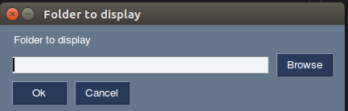
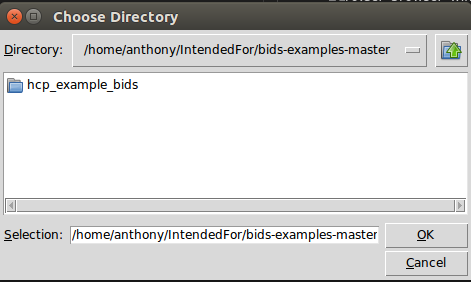
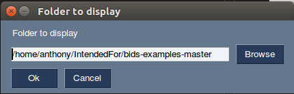
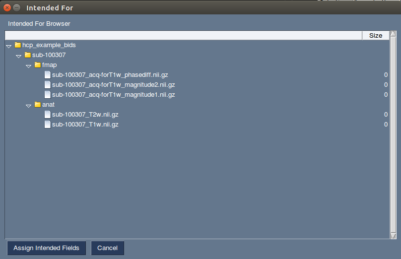
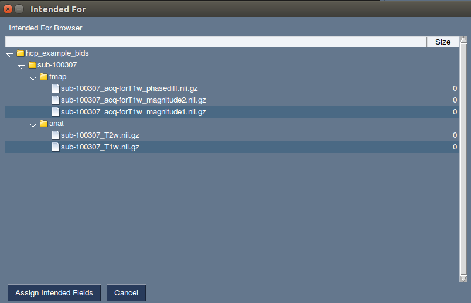

# SimpleIF GUI
This gui exists to provide a user with a browsable interface to select fmaps
for use as intended for objects with other bids jsons.
# Requirements
- pysimplegui
- python3-tk

PySimpleGUI is the only exernal python library needed to run this program, 
it can be installed via pip into your desired Python3 install:
```bash
[galassi@exahead1 simple_if]$ pip3 install pysimplegui
```  
Or if the above doesn't work installed to your user profile:
```bash
[galassi@exahead1 simple_if]$ pip3 install pysimplegui --user
```  

Note: At the time of this writing python3-tk must be installed via command line
```bash
sudo apt-get install python3-tk
```

Note: There may be issues with running this project on python > 3.6 according to 
the documentation for pysimpleGUI.

# Usage
Clone repository: `git clone git@github.com:DCAN-Labs/simple-if.git`
Launch via `python3 simple_if.py`:

```bash
anthony@anthony-VirtualBox:~/simple_if$ python3 simple_if.py
```  



Next browse to the desired subject/session folder you wish to add fieldmaps to the intended for bids option.
Choose the desired scan and select `open`.  
  
Then press `OK`

At this window below you then confirm you've selected the correct directory, and if so press `OK`.  


Now you should be able to inspect the folder for your nifti images.  
Next, select the fmap(s) you wish to assign to your other mri scan types, then hold ctrl and click on the nifti's that you 
intend your field maps for.  



Once you've selected your images like below:  


And press the `Assign IntendedFor` button to assign the fieldmaps to the images you've selected.

That's it.
